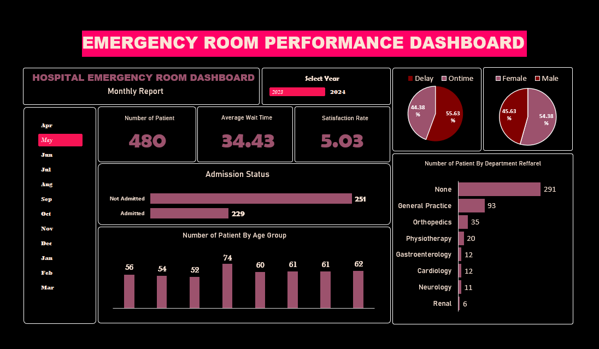

# 📊 Excel Analytics Masterclass Portfolio

**A structured, end-to-end collection of Excel data analytics projects — from raw data cleaning to interactive dashboards.**

This repository documents my progression through core data analyst skills in Microsoft Excel: cleaning messy data, enforcing data quality, building calculation engines, automating ETL with Power Query, summarizing data with Pivot Tables, modeling relational data with Power Pivot & DAX, and delivering a full interactive dashboard.

📌 **Author:** Rifatul Hasan
🔗 [LinkedIn](#) · [Portfolio](#) · [Email](#)
*(replace the links above with your actual profile URLs)*

---

## 🗂️ Portfolio Modules

| # | Module | Focus | Key Skills |
|---|--------|-------|------------|
| 01 | [Data Cleaning](./01_Data_Cleaning) | Structural preprocessing | `TRIM`, `PROPER`, Text to Columns, deduplication |
| 02 | [Data Validation](./02_Data_Validation) | Data entry governance | Input rules, custom validation formulas, dropdowns |
| 03 | [Excel Formulas](./03_Excel_Formulas) | Logic & calculation engines | `VLOOKUP`, `INDEX/MATCH`, `SUMIFS`, `SUMPRODUCT`, nested `IF` |
| 04 | [Power Query](./04_Power_Query) | Automated ETL | Append/Merge Queries, folder connectors, Pivot/Unpivot |
| 05 | [Pivot Table Analytics](./05_Pivot_Table) | Data summarization & reporting | Slicers, Timelines, Calculated Fields, `GETPIVOTDATA` |
| 06 | [Power Pivot](./06_Power_Pivot) | Data modeling & DAX | Star schema, relationships, DAX measures, Time Intelligence |
| 07 | [Hospital ER Dashboard](./07_Hospital_Emergency_Room_Dashboard) | Capstone dashboard | Full BI workflow — cleaning → modeling → interactive dashboard |

---

## 📁 01 — Data Cleaning
**Focus: Structural Data Preprocessing & Pipeline Building**

- **Objective:** Transform chaotic, multi-source tracking records into pristine, analysis-ready tabular models.
- **Cleaning tasks:**
  - Removed duplicate records
  - Standardized text case (`UPPER`, `LOWER`, `PROPER`)
  - Reconciled inconsistent category labels referring to the same value (e.g., "Islamic History and Culture" vs. "IHC" vs. the Bengali equivalent) into a single standard label
  - Stripped extra whitespace (`TRIM`)
  - Cleaned currency fields — removed currency symbols and converted text to numeric values
  - Standardized inconsistent date formats into a single format (e.g., Short Date)
  - Fixed row/column formatting issues
  - Used Find & Replace for bulk corrections
  - Lower-cased the Client column for consistency
  - Split combined fields using Text to Columns
  - Located blank cells and bulk-filled them (`Ctrl + Enter`)
  - Wrapped error-prone formulas with `IFERROR`
  - Applied AutoFilter (`Ctrl + Shift + L`) for quick inspection and QA of cleaned data

---

## 📁 02 — Data Validation
**Focus: Proactive Data Entry Governance**

- **Objective:** Build automated spreadsheet constraints that block bad data at the point of entry, rather than cleaning it up afterward.
- **Validation rules implemented:**
  - Any Value (unrestricted control fields)
  - Text-only fields
  - Fixed-length numeric entry — exactly 11-digit phone numbers
  - Duplicate-blocking validation (no repeated entries in a field)
  - Date-range validation (entries restricted to a valid date window)
  - Time-range validation (entries restricted to a valid time window)
  - Numeric-only entry for Age fields
  - Decimal-range validation (values constrained within a defined min/max)

---

## 📁 03 — Excel Formulas
**Focus: Advanced Logic, Strings & Calculation Engines**

- **Objective:** Implement robust formulas for relational data extraction, conditional math, and text parsing.
- **Techniques:**
  - **Lookup:** `VLOOKUP`, `HLOOKUP`, `INDEX & MATCH`
  - **Text parsing:** `SUBSTITUTE`, `LEFT`, `MID`, `RIGHT`, `FIND`
  - **Conditional logic:** `SUMIFS`, `COUNTIFS`, `AVERAGEIFS`, `SUBTOTAL`, `SUMPRODUCT`, nested `IF`

---

## 📁 04 — Power Query
**Focus: Automated Data Import, Transformation & Consolidation**

- **Objective:** Automate data ingestion from diverse sources and consolidate multi-file structures into refresh-ready models.

| Chapter | Topic | Key Skills |
|---|---|---|
| 1 | Data Cleaning | Removing duplicates, fixing data types, trimming whitespace, handling nulls |
| 2 | Importing from Various Sources | PDF, Web, multi-sheet imports; Pivot & Unpivot |
| 4 | Appending Multiple Workbooks | Folder connector, combining annual files (2014–2018) |
| 5 | Appending CSV Files | Merging regional CSVs (Central, North, South, West) |
| 6 | Advanced Grouping | Multi-column Group By, custom aggregations |

- **Techniques:** Power Query Editor, Append/Merge Queries, folder-based dynamic loads, data type enforcement, step-by-step M query pipelines.

---

## 📁 05 — Pivot Table Analytics
**Focus: Multidimensional Data Summarization & Interactive Reporting**

- **Objective:** Transform raw transactional data into dynamic business reports through aggregation, filtering, and visualization.
- **Covered:**
  - Dynamic Pivot Tables from Excel Tables (auto-refresh on source expansion)
  - Filters (Report, Row, Column, Label, Value, Top 10)
  - Slicers & Timelines for interactive, connected filtering
  - Grouping (numeric ranges, dates, manual categories)
  - **Show Values As** (% of Total, Running Total, Rank, Index, etc.)
  - Calculated Fields for custom business metrics (e.g., commission, bonus logic)
  - Pivot Charts (column, bar, line, pie)
  - `GETPIVOTDATA` for dynamic dashboard summaries
- **Business use cases:** sales performance, regional reporting, customer segmentation, HR analytics, KPI monitoring.

---

## 📁 06 — Power Pivot
**Focus: Data Modeling, Relationships & DAX**

A two-workbook module simulating enterprise-style reporting on a star schema data model.

**Workbook 1 — Power Pivot Fundamentals**
- Built a star schema across `Customers`, `Products`, `Stores`, `Date`, and `Sales_Fact` tables
- Created one-to-many relationships and DAX measures: Total Sales, Total Orders, AOV, Total Profit, Profit Margin
- Reports: Monthly Net Revenue, Quarterly AOV, Profit Margin by Month/Category/Gender

**Workbook 2 — Time Intelligence using DAX**
- Built a dedicated Calendar table and date relationships
- Time Intelligence measures: YTD, QTD, MTD, `SAMEPERIODLASTYEAR()`, `PREVIOUSMONTH()`
- Reports: Sales by Year, Monthly Sales, Prior-Period Comparisons

- **Skills:** Data modeling, star schema design, filter/row context, DAX measures, Time Intelligence.

---

## 🏥 07 — Hospital Emergency Room Dashboard *(Capstone Project)*

An interactive Excel dashboard analyzing emergency room operations — the module that ties together every skill in this portfolio: data cleaning, Power Query transformation, Pivot Tables, and dashboard design.

**Project overview:** Tracks patient flow, admissions, wait times, and satisfaction, with interactive Year/Month filtering.

**KPIs tracked:**
- Total Patients
- Average Wait Time
- Patient Satisfaction Score
- Admission Status
- Department Referrals
- Gender & Age Group Distribution
- Delayed vs. On-Time Patients

**Tools & techniques:** Power Query, Pivot Tables, Pivot Charts, Slicers, Excel formulas, conditional formatting.

**Dashboard preview:**

---

## 🛠️ Tools & Techniques Across This Portfolio

`Excel Formulas` · `Data Validation` · `Power Query (M)` · `Pivot Tables` · `Pivot Charts` · `Power Pivot` · `DAX` · `Data Modeling` · `Slicers & Timelines` · `Dashboard Design` · `Conditional Formatting`

---

## 📈 What This Portfolio Demonstrates

- Ability to take raw, messy, real-world data and turn it into clean, validated, analysis-ready datasets
- Building automated, refreshable ETL pipelines instead of manual data wrangling
- Designing relational data models (star schema) and writing production-style DAX measures
- Translating data into interactive, decision-ready dashboards for non-technical stakeholders

---

*Created and maintained as part of an intensive Excel data analytics mastery sprint.*
